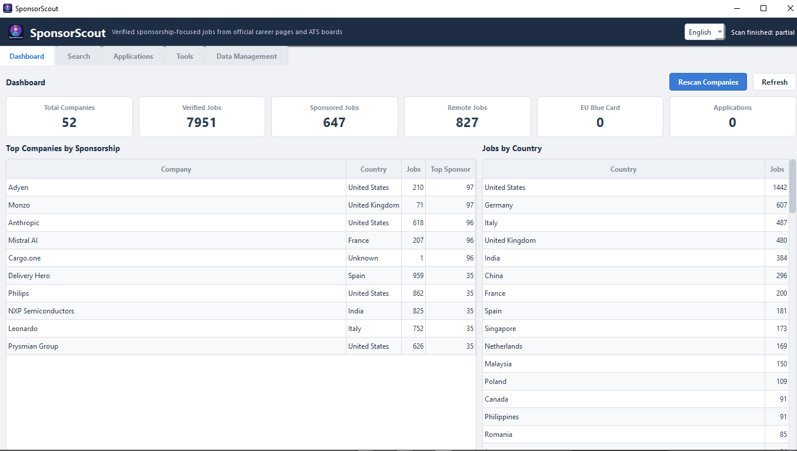
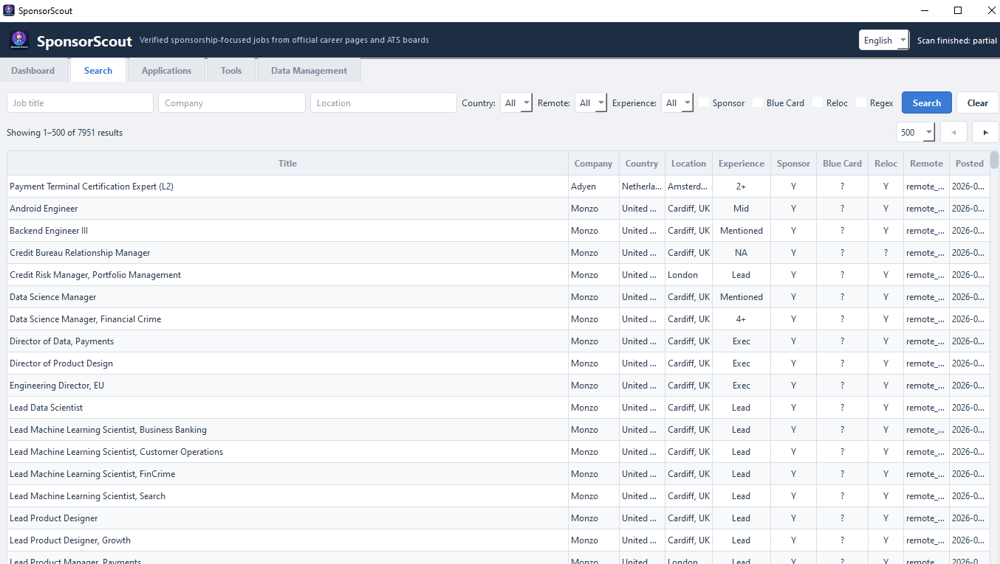
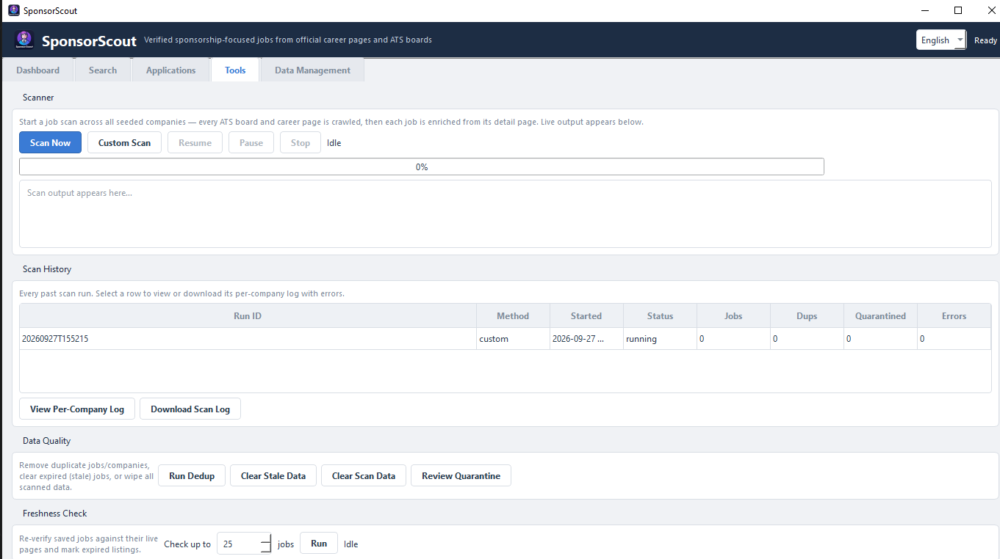
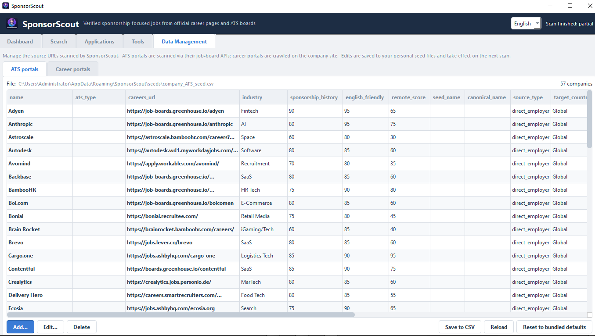

# SponsorScout

[🇬🇧 English](#-english) · [🇮🇹 Italiano](#-italiano)

Find jobs that actually sponsor visas — scanned from official sources, stored
on your own computer.

---

# 🇬🇧 English

## 📖 Contents

- [Download](#-download)
- [Screenshots](#-screenshots)
- [What It Does](#-what-it-does)
- [Quick Start](#-quick-start)
- [The Five Tabs](#-the-five-tabs)
- [Scanning](#-scanning)
- [Where Your Data Lives](#-where-your-data-lives)
- [Troubleshooting](#-troubleshooting)
- [Building From Source](#-building-from-source)
- [Requirements](#-requirements)
- [License](#-license)

---

## 📥 Download

Installers are on the [GitHub Releases page](https://github.com/Kazake95/SponsorScout/releases):

| Platform | File |
|----------|------|
| Windows 10 / 11 | `sponsorscout-<version>-setup.exe` |
| Linux (Debian / Ubuntu / Mint) | `sponsorscout_<version>_<arch>.deb` |
| Linux (Fedora / RHEL / openSUSE) | `sponsorscout-<version>-1.<arch>.rpm` |

`<arch>` is your machine's architecture (`amd64` on most desktops, `arm64` on
Raspberry Pi / Graviton). Pick the file for your platform. The app and its
browser are bundled, so no Python is needed.

Installing the Linux packages:

```bash
# Debian / Ubuntu / Mint
sudo apt install ./sponsorscout_<version>_<arch>.deb

# Fedora / RHEL / openSUSE
sudo dnf install ./sponsorscout-<version>-1.<arch>.rpm   # or: sudo zypper install ...
```

Both packages install to `/opt/sponsorscout` and add a launcher plus a desktop
entry; the bundled Chromium is used automatically.

---

## 📸 Screenshots

**Dashboard — KPIs, top sponsoring companies and jobs by country**


**Search — filters, tri-state sponsorship columns and pagination**


**Tools — scan control, live progress log, run history and data quality**


**Data Management — editable ATS and career seed files**


---

## ✨ What It Does

- **Scans official sources only** — 8 ATS job boards (Ashby, Greenhouse,
  Lever, SmartRecruiters, Personio, Recruitee, Workable, Workday) through their
  public APIs, plus company career pages with a headless browser when needed.
- **Classifies every job** — sponsorship, relocation support, remote type and
  EU Blue Card eligibility, detected from the job description.
- **Extracts the experience requirement** — the exact figure the ad states
  (`4+`, `3-5 years`, `6 months`), or the seniority level (`Senior`), read in
  English, German, Italian, Dutch, French, Spanish and Portuguese.
- **Keeps everything local** — one SQLite file on your computer. Nothing is
  uploaded.
- **Tracks applications** — Saved → Applied → Interview → Offer → Rejected.
- **Two languages** — English and Italian, switchable at any time.

---

## 🚀 Quick Start

1. Download and install the package for your platform.
2. Launch SponsorScout. On first start, accept the prompt to run an initial
   scan (1–3 minutes).
3. Open **Search** to browse, and **Applications** to track what you apply to.

---

## 🗂 The Five Tabs

### 1. Dashboard
Totals for companies, verified jobs, sponsored, remote and EU Blue Card jobs,
plus top companies by sponsorship and jobs by country. **Rescan Companies**
starts a full scan; **Refresh** reloads the numbers.


### 2. Search
The main job browser.

- **Filter** by title, company, location, country, remote type, experience,
  sponsorship, Blue Card and relocation. Tick **Regex** to use a pattern in the
  text fields.
- **Dropdowns always show every value found in your data** — never narrowed by
  the current selection, so you can switch to any other value directly.
- **Filter values and table values are identical** and stay in one fixed
  (untranslated) form in both languages, so filters never break when you switch
  language. Only labels, headers and buttons are translated.
- **Experience** shows the requirement as stated: `4+`, `3-5`, `6 mo`, `None`
  when the ad explicitly asks for none, `Senior` for a level, and one single `?`
  when the ad states no figure and no level — whether it only mentions
  experience ("customer support experience is a plus") or never mentions it at
  all. Sorting is numeric, so `3-5` comes before `11+`. Hover for the detail:
  the exact figure, or what the ad actually said.
- **Sort** by clicking any column header (click again to reverse).
- **Column widths follow the content** — no value is cut off — and every
  column, Title included, is **resizable**: drag a divider and it stays where
  you put it, even after a page change or a new search. Double-click a divider
  to fit that column to its content again; a value too long to show (or a
  column you squeezed) shows its full text on hover.
- **Right-click** a row to open it in your browser or save it to Applications.
- **Pagination** — results are shown one page at a time (100, 200, 500 or 1000
  rows, default 500) with a result counter and ◀ / ▶ buttons, so large
  databases stay responsive and every row stays reachable.


### 3. Applications
Your pipeline. Select a saved job to set its status and add notes.

### 4. Tools
- **Scanner** — **Scan Now** runs a full scan; **Custom Scan** lets you pick
  companies and source types. **Pause** suspends the running scan in place
  (workers stop at the next company, browsers stay open) and the same button
  becomes **Resume**, continuing instantly — no new run is started. **Stop**
  ends the scan and keeps everything found so far; the stopped run is
  checkpointed, so **Resume** (next to the scan buttons) starts a new scan for
  the companies that were not finished, even after restarting the app. See
  [Scanning](#-scanning).
- **Scan History** — every past run; select one to read or download its
  per-company log. Stopped runs show `cancelled` and become `resumed` when a
  later run finishes the remaining work.
- **Data Quality** — remove duplicate jobs/companies, clear expired jobs, or
  wipe all scanned data.
- **Freshness Check** — re-verify saved jobs against their live pages and mark
  dead listings as expired.


### 5. Data Management
Edit the company lists that get scanned (**ATS portals** and **Career
portals**). Changes apply on the next scan; **Reset to bundled defaults**
restores the original lists.


---

## 🔍 Scanning

### Full scan
The default. **Scan Now** (or the Dashboard's **Rescan Companies**) scans every
seeded company, because a partial scan would silently hide jobs you did not ask
for.

### Custom scan
**Tools → Custom Scan** lets you choose:

- **Source types** — *ATS portals* (fast, API-based) and/or *Career portals*
  (slower, crawled with a browser).
- **Companies** — tick the ones you want; filter or bulk-select to move fast.

A custom scan runs the exact same pipeline as a full scan, so result quality is
identical — only the scope and duration change. Use it to re-scan companies you
just edited. Custom runs appear as `custom` in Scan History.

### What a scan does
1. **ATS boards** — companies with a known ATS are pulled through the official
   job-board API.
2. **Career pages** — every company is also crawled through its own career page,
   so career-page-only companies are never skipped.
3. **Detail pages** — each job is checked for location, sponsorship,
   relocation, Blue Card evidence and experience. Verdicts are only set from
   explicit evidence, and weaker sources never overwrite stronger ones.
4. Results are saved to the local database and appear immediately.

Progress shows live (`ATS 12/46`, `Career 88/162`). A company with no open
roles counts as done.

---

## 💾 Where Your Data Lives

| Platform | Location |
|----------|----------|
| Windows | `%APPDATA%\SponsorScout` |
| Linux | `~/.sponsorscout` |

Contains `sponsorscout.db` (jobs, companies, applications, scan history),
`seeds/` (your editable company lists), `locale.json` (language) and raw scan
logs under `scan_output/`.

Copy `sponsorscout.db` to back everything up. Override the location with the
`SPONSORSCOUT_DATA_DIR` (or `SPONSORSCOUT_DB_PATH`) environment variable.

### Uninstalling

The Windows installer, the Linux `.deb` and the Linux `.rpm` all remove
SponsorScout-owned user data when the app is uninstalled — the SQLite database,
editable seeds, language setting and scan logs. The default locations are
cleaned for the current Windows user and for local Linux user accounts. Custom
data paths are also removed when their `SPONSORSCOUT_DATA_DIR` /
`SPONSORSCOUT_DB_PATH` environment variables are available to the uninstaller.
Back up anything you want to keep before uninstalling. The shared Playwright
browser cache is not removed because other applications may use it.

On Linux the two packages behave identically; `apt remove sponsorscout` /
`dnf remove sponsorscout` does the same as the Windows uninstaller.

---

## 🧰 Troubleshooting

**The Dashboard looks empty after a scan.** Click **Refresh**. If still empty,
check the newest **Scan History** row — an `error` status, or failures in its
log, shows which companies returned nothing.

**"Playwright is required for DOM fallback" / "Chromium browser is not
available".** Career pages are crawled with Playwright, and installers bundle
both the library and Chromium. To see exactly what is wrong in an installed
build, run:

```bash
/opt/sponsorscout/SponsorScout --self-check --self-check-browser
"C:\Program Files\SponsorScout\SponsorScout.exe" --self-check --self-check-browser
```

It reports whether `playwright` imports (including *why* it fails, e.g. a
missing `greenlet`), where Playwright looks for browsers, and whether the
bundled Chromium launches — without opening the app. Builds run this
automatically and refuse to package a broken bundle. From source, run
`python -m playwright install chromium`.

**SponsorScout will not download a browser by itself.** If Chromium is missing
the app logs a warning and keeps working, but JS-rendered career pages return 0
jobs. Install it once with `python -m playwright install chromium`. To restore
the old automatic behaviour set `SPONSORSCOUT_AUTO_INSTALL_BROWSERS=1` — it is
off by default because a ~130 MB download can block the scan for minutes.
Installed builds are unaffected: the browser ships inside the `.exe`, `.deb`
and `.rpm`.

**Some companies returned no jobs.** They may have no open roles (`EMPTY` in
the log), or they may temporarily block automated access — try again later.
Nothing is dropped silently.

**The scan is slow.** The detail-page pass is the slow part, and it is bounded:
SponsorScout sizes its browser pool from your CPU/RAM, runs at below-normal
priority, and blocks images/fonts/media while crawling. The Dashboard stays
usable. You do not have to wait it out — press **Pause** to suspend the scan
where it is (nothing is lost, browsers just wait) and click the same button
again to continue instantly. **Stop** ends the run and keeps everything found,
and **Resume** later continues the unfinished companies, even after restarting
the app.

**A job shows `?`.** `?` means *unknown*, never *no*. The ad had no explicit
evidence, so SponsorScout does not guess. Unknown jobs are never removed.

**Can I scan only some companies?** Yes — **Tools → Custom Scan**. Same
quality, only the scope changes.

**How do I search with a regular expression?** Tick **Regex** in **Search** and
type a pattern such as `(backend|platform).*engineer`. Case-insensitive; an
invalid pattern warns and falls back to a normal search.

**Does anything leave my computer?** No. The only outbound traffic is fetching
the job listings you asked for.

---

## 🏗 Building From Source

```powershell
python -m venv venv
venv\Scripts\activate
pip install -r requirements.txt   # runtime + pyinstaller (used by the build scripts)
pip install -e ".[dev]"          # pytest, for the test suite
python -m playwright install chromium
```

`requirements.txt` is what the build scripts (`build_exe.ps1`, `build_deb.sh`,
`build_rpm.sh`) consume, so it must keep `pyinstaller`. The `.[dev]` extra adds
`pytest` for the suite; `pip install -e .` alone is enough if you only want to
run the app.

If you skip `playwright install chromium`, the app still starts but
JS-rendered career pages return 0 jobs. It will **not** download ~130 MB on its
own; set `SPONSORSCOUT_AUTO_INSTALL_BROWSERS=1` if you want that behaviour back.

**Windows installer:**
```powershell
.\build_exe.ps1               # -> dist\sponsorscout-<version>-setup.exe
```
(requires Inno Setup 6/7; bundles Playwright Chromium)

**Linux package (Debian / Ubuntu):**
```bash
./build_deb.sh                # -> dist/sponsorscout_<version>_<arch>.deb
```
Run it as your normal user: **do not use `sudo`**. The script creates an
isolated build environment in `.build/deb-venv`, so it never modifies the
system Python. If Python's venv module is missing, install it once with
`sudo apt install python3-venv`, then run `./build_deb.sh` again.
Packaging the ~1.4 GB payload (PySide6 + bundled Chromium) is the slow step and
prints how long it took; the `.deb` only appears in `dist/` once it is complete.
For a much faster build that requires dpkg >= 1.21.18 to install, use
`DEB_COMPRESSION=zstd ./build_deb.sh`.
Building from a Windows drive mounted in WSL (`/mnt/c/...` and friends) is not
recommended: those filesystems cannot store Unix permissions, so the build
detects it and stages the package in `/tmp`. For the fastest and most
reliable build, copy the project to a Linux filesystem such as `~/sponsorscout`.

**Linux package (Fedora / RHEL / openSUSE — RPM):**
```bash
./build_rpm.sh               # -> dist/sponsorscout-<version>-1.<arch>.rpm
```
Same rules as the `.deb`: run it as your normal user (**do not use `sudo`**)
and let it create the isolated `.build/rpm-venv`. Requires `rpmbuild`
(`sudo dnf install rpm-build` on Fedora/RHEL, `sudo apt install rpm` on
Debian/Ubuntu/WSL, `sudo zypper install rpm-build` on openSUSE). It bundles
Playwright Chromium, smoke-tests the binary and never strips the bundled
C-extensions — exactly like `build_deb.sh`. The payload compressor is probed
on your machine (fast xz by default); for a smaller package where every
target has rpm >= 4.14, use `RPM_COMPRESSION=zstd ./build_rpm.sh`. Like the
other two scripts it leaves `dist/` alone apart from its own output, so the
`.exe`, `.deb` and `.rpm` can be built side by side.

**Tests:**
```bash
python -m pytest sponsorscout/tests
```

---

## 📋 Requirements

- Python 3.10 or newer (to run from source; installers need nothing)
- Runtime: **PySide6**, **requests**, **playwright** (`requirements.txt`)
- Playwright Chromium: `python -m playwright install chromium`
- Dev/test: **pytest**, **pyinstaller** (`pip install ".[dev]"`)
- Linux packaging: `python3`, `python3-venv`, and `dpkg` (`sudo apt install python3-venv`); `rpmbuild` for the `.rpm` (`sudo dnf install rpm-build` / `sudo apt install rpm`)
- Optional: `SPONSORSCOUT_AUTO_INSTALL_BROWSERS=1` lets the app download Chromium itself when it is missing (off by default)

---

## 📄 License

MIT — see [LICENSE](LICENSE).

---

# 🇮🇹 Italiano

## 📖 Indice

- [Scarica](#-scarica)
- [Schermate](#-schermate)
- [Cosa Fa](#-cosa-fa)
- [Avvio Rapido](#-avvio-rapido)
- [Le Cinque Schede](#-le-cinque-schede)
- [Scansione](#-scansione)
- [Dove Sono i Tuoi Dati](#-dove-sono-i-tuoi-dati)
- [Risoluzione Problemi](#-risoluzione-problemi)
- [Compilare dai Sorgenti](#-compilare-dai-sorgenti)
- [Requisiti](#-requisiti)
- [Licenza](#-licenza)

---

## 📥 Scarica

Gli installer sono nella [pagina GitHub Releases](https://github.com/Kazake95/SponsorScout/releases):

| Piattaforma | File |
|-------------|------|
| Windows 10 / 11 | `sponsorscout-<versione>-setup.exe` |
| Linux (Debian / Ubuntu / Mint) | `sponsorscout_<versione>_<arch>.deb` |
| Linux (Fedora / RHEL / openSUSE) | `sponsorscout-<versione>-1.<arch>.rpm` |

`<arch>` è l'architettura della tua macchina (`amd64` sulla maggior parte dei
desktop, `arm64` su Raspberry Pi / Graviton). Scegli il file per la tua
piattaforma. L'app e il browser sono inclusi, quindi non serve Python.

Installare i pacchetti Linux:

```bash
# Debian / Ubuntu / Mint
sudo apt install ./sponsorscout_<versione>_<arch>.deb

# Fedora / RHEL / openSUSE
sudo dnf install ./sponsorscout-<versione>-1.<arch>.rpm   # oppure: sudo zypper install ...
```

Entrambi i pacchetti installano in `/opt/sponsorscout` e aggiungono un launcher
più una voce nel menu applicazioni; il Chromium incluso viene usato
automaticamente.

---

## 📸 Schermate

**Pannello — KPI, migliori aziende per sponsorizzazione e lavori per paese**


**Cerca — filtri, colonne tri-stato e paginazione**


**Strumenti — controllo scansione, log live, cronologia e qualità dati**


**Gestione Dati — file seed ATS e Career modificabili**


---

## ✨ Cosa Fa

- **Scansiona solo fonti ufficiali** — 8 bacheche ATS (Ashby, Greenhouse,
  Lever, SmartRecruiters, Personio, Recruitee, Workable, Workday) tramite le
  loro API pubbliche, più le pagine carriera delle aziende con un browser
  headless quando necessario.
- **Classifica ogni lavoro** — sponsorizzazione, trasferimento, tipo di lavoro
  remoto e idoneità alla Carta Blu UE, rilevati dalla descrizione.
- **Estrae l'esperienza richiesta** — la cifra esatta indicata
  (`4+`, `3-5 anni`, `6 mesi`), oppure il livello di seniority (`Senior`),
  riconosciuta in inglese, tedesco, italiano, olandese, francese, spagnolo e
  portoghese.
- **Mantiene tutto in locale** — un unico file SQLite sul tuo computer. Nulla
  viene caricato online.
- **Gestisce le candidature** — Salvata → Inviata → Colloquio → Offerta →
  Rifiutata.
- **Due lingue** — Italiano e Inglese, selezionabili in qualsiasi momento.

---

## 🚀 Avvio Rapido

1. Scarica e installa il pacchetto per la tua piattaforma.
2. Avvia SponsorScout. Al primo avvio accetta la richiesta di eseguire la
   scansione iniziale (1–3 minuti).
3. Apri **Cerca** per sfoglare e **Candidature** per gestire le candidature.

---

## 🗂 Le Cinque Schede

### 1. Pannello
Totali di aziende, lavori verificati, sponsorizzati, remoti e con Carta Blu
UE, più le migliori aziende per sponsorizzazione e i lavori per paese.
**Riscansiona Aziende** avvia una scansione completa; **Aggiorna** ricarica i
numeri.


### 2. Cerca
Il browser principale dei lavori.

- **Filtra** per posizione, azienda, località, paese, tipo di lavoro remoto,
  esperienza, sponsorizzazione, Carta Blu e trasferimento. Spunta **Regex** per
  usare un pattern nei campi di testo.
- **I menu a tendina mostrano sempre tutti i valori** presenti nei tuoi dati,
  mai ridotti alla selezione corrente: puoi passare direttamente a qualsiasi
  altro valore.
- **I valori dei filtri coincidono con quelli della tabella** e restano in una
  forma fissa (non tradotta) in entrambe le lingue, così i filtri non si
  rompono cambiando lingua. Solo etichette, intestazioni e pulsanti vengono
  tradotti.
- **Esperienza** mostra il requisito come indicato: `4+`, `3-5`, `6 mo`, `None`
  quando l'annuncio chiede esplicitamente nessuna esperienza, `Senior` per un
  livello e un unico `?` quando l'annuncio non indica né cifre né livello — sia
  quando cita l'esperienza ("customer support experience is a plus"), sia quando
  non ne parla affatto. L'ordinamento è numerico, così `3-5` precede `11+`.
  Passa il mouse per il dettaglio: la cifra esatta o cosa dice davvero
  l'annuncio.
- **Ordina** cliccando l'intestazione di una colonna (clicca di nuovo per
  invertire).
- **Le larghezze delle colonne seguono il contenuto** — nessun valore viene
  tagliato — e ogni colonna, Titolo incluso, è **ridimensionabile**: trascina
  un divisore e resta dove lo metti, anche cambiando pagina o eseguendo una
  nuova ricerca. Fai doppio clic su un divisore per riadattare quella colonna
  al contenuto; un valore troppo lungo (o una colonna che hai ridotto) si legge
  per intero passando il mouse.
- **Tasto destro** su una riga per aprirla nel browser o salvarla nelle
  Candidature.
- **Paginazione** — i risultati sono mostrati una pagina alla volta (100, 200,
  500 o 1000 righe, 500 per impostazione predefinita) con contatore e pulsanti
  ◀ / ▶, così i database grandi restano rapidi e ogni riga resta
  raggiungibile.


### 3. Candidature
Il tuo percorso. Seleziona un lavoro salvato per impostarne lo stato e
aggiungere note.

### 4. Strumenti
- **Scanner** — **Scansiona Ora** esegue una scansione completa; **Scansione
  Personalizzata** ti lascia scegliere aziende e tipi di fonte. **Pausa**
  sospende la scansione sul posto (i worker si fermano alla prossima azienda, i
  browser restano aperti) e lo stesso pulsante diventa **Riprendi**, per
  continuare subito — nessuna nuova esecuzione viene avviata. **Ferma** termina
  la scansione mantenendo tutto ciò che è stato trovato; l'esecuzione interrotta
  viene salvata, quindi **Riprendi** (accanto ai pulsanti di scansione) avvia una
  nuova scansione solo per le aziende non finite, anche dopo aver riavviato
  l'app. Vedi [Scansione](#-scansione).
- **Cronologia Scansioni** — ogni esecuzione passata; selezionane una per
  leggere o scaricare il registro per azienda. Le scansioni fermate mostrano
  `cancelled` e diventano `resumed` quando un'esecuzione successiva completa il
  lavoro rimanente.
- **Qualità Dati** — rimuovi lavori/aziende duplicati, cancella lavori
  scaduti o elimina tutti i dati scansionati.
- **Verifica Aggiornamento** — riverifica i lavori salvati sulle pagine live e
  segna gli annunci non più disponibili come scaduti.


### 5. Gestione Dati
Modifica gli elenchi di aziende che vengono scansionati (**Portali ATS** e
**Portali Career**). Le modifiche hanno effetto dalla scansione successiva;
**Ripristina predefiniti** riporta gli elenchi originali.


---

## 🔍 Scansione

### Scansione completa
Quella predefinita. **Scansiona Ora** (o **Riscansiona Aziende** nel Pannello)
scansiona ogni azienda negli elenchi, perché una scansione parziale
nasconderebbe in silenzio dei lavori che non hai chiesto.

### Scansione personalizzata
**Strumenti → Scansione Personalizzata** ti lascia scegliere:

- **Tipi di fonte** — *Portali ATS* (veloci, via API) e/o *Portali Career*
  (più lenti, esplorati con un browser).
- **Aziende** — spunta quelle che ti servono; usa il filtro o la selezione
  rapida per spostarti in fretta.

Una scansione personalizzata usa esattamente la stessa pipeline di una scansione
completa, quindi la qualità dei risultati è identica: cambiano solo ambito
e durata. Usala per riscanare le aziende che hai appena modificato. Le
esecuzioni personalizzate compaiono come `custom` nella Cronologia Scansioni.

### Cosa fa una scansione
1. **Bacheche ATS** — le aziende con un ATS noto vengono interrogate tramite
   l'API ufficiale della bacheca.
2. **Pagine carriera** — ogni azienda viene esplorata anche sulla propria
   pagina carriera, quindi le aziende con la sola pagina carriera non vengono
   saltate.
3. **Pagine di dettaglio** — ogni lavoro viene verificato per località,
   sponsorizzazione, trasferimento, Carta Blu UE ed esperienza. I verdetti
   vengono impostati solo con evidenze esplicite e le fonti più deboli non
   sovrascrivono mai quelle più forti.
4. I risultati vengono salvati nel database locale e compaiono subito.

L'avanzamento è live (`ATS 12/46`, `Carriere 88/162`). Un'azienda senza
posizioni aperte conta come completata.

---

## 💾 Dove Sono i Tuoi Dati

| Piattaforma | Posizione |
|-------------|-----------|
| Windows | `%APPDATA%\SponsorScout` |
| Linux | `~/.sponsorscout` |

Contiene `sponsorscout.db` (lavori, aziende, candidature, cronologia scansioni),
`seeds/` (i tuoi elenchi modificabili), `locale.json` (lingua) e i log grezzi
in `scan_output/`.

Copia `sponsorscout.db` per salvare tutto. Puoi cambiare la posizione con la
variabile d'ambiente `SPONSORSCOUT_DATA_DIR` (o `SPONSORSCOUT_DB_PATH`).

### Disinstallazione

L'installer Windows, il pacchetto Linux `.deb` e il pacchetto Linux `.rpm`
rimuovono durante la disinstallazione tutti i dati locali di SponsorScout:
database SQLite, elenchi modificabili, lingua e log delle scansioni. Vengono
pulite le posizioni predefinite dell'utente Windows e degli account Linux
locali. Vengono rimosse anche le posizioni personalizzate se le variabili
`SPONSORSCOUT_DATA_DIR` / `SPONSORSCOUT_DB_PATH` sono disponibili al programma
di disinstallazione. Fai una copia di cio che vuoi conservare prima di
disinstallare. La cache condivisa dei browser Playwright non viene rimossa,
perche potrebbe servire ad altre applicazioni.

Su Linux i due pacchetti si comportano allo stesso modo; `apt remove
sponsorscout` / `dnf remove sponsorscout` equivalgono alla disinstallazione
Windows.

---

## 🧰 Risoluzione Problemi

**Il Pannello sembra vuoto dopo una scansione.** Clicca **Aggiorna**. Se è
ancora vuoto, controlla l'ultima riga della **Cronologia Scansioni**: uno stato
`error`, o errori nel registro, indicano quali aziende non hanno restituito
lavori.

**"Playwright is required for DOM fallback" / "Chromium browser is not
available".** Le pagine carriera vengono esplorate con Playwright, e gli
installer includono sia la libreria sia Chromium. Per vedere esattamente cosa
non funziona in una build installata, esegui:

```bash
/opt/sponsorscout/SponsorScout --self-check --self-check-browser
"C:\Program Files\SponsorScout\SponsorScout.exe" --self-check --self-check-browser
```

Riporta se `playwright` si importa (incluso il *motivo* di un eventuale
errore, ad esempio `greenlet` mancante), dove Playwright cerca i browser e se
il Chromium incluso si avvia — senza aprire l'app. Le build eseguono questo
controllo automaticamente e rifiutano di pacchettizzare un bundle rotto. Da
codice sorgente, esegui `python -m playwright install chromium`.

**SponsorScout non scarica un browser da solo.** Se Chromium manca, l'app
scrive un avviso e continua a funzionare, ma le pagine carriera renderizzate via
JavaScript restituiscono 0 lavori. Installalo una volta con
`python -m playwright install chromium`. Per riattivare il comportamento
automatico di prima imposta `SPONSORSCOUT_AUTO_INSTALL_BROWSERS=1`: e disattivato
perche un download di ~130 MB puo bloccare la scansione per minuti. Le build
installate non ne risentono: il browser e incluso dentro `.exe`, `.deb` e
`.rpm`.

**Alcune aziende non hanno restituito lavori.** Potrebbero non avere posizioni
aperte (`EMPTY` nel log) oppure bloccare temporaneamente l'accesso automatico:
riprova più tardi. Nulla viene perso in silenzio.

**La scansione è lenta.** La fase di dettaglio è la più lenta ed è limitata:
SponsorScout dimensiona i browser in base a CPU/RAM, gira con priorità
inferiore al normale e blocca immagini/font/media. Il Pannello resta
utilizzabile. Non devi aspettare tutto: premi **Pausa** per sospendere la
scansione dove si trova (nulla va perso, i browser attendono) e clicca di nuovo
lo stesso pulsante per continuare subito. **Ferma** termina l'esecuzione
mantenendo tutto ciò che è stato trovato, e **Riprendi** più tardi continua le
aziende non finite, anche dopo aver riavviato l'app.

**Un lavoro mostra `?`.** `?` significa *sconosciuto*, mai *no*. L'annuncio non
conteneva evidenze esplicite, quindi SponsorScout non ipotizza nulla. I lavori
sconosciuti non vengono mai rimossi.

**Posso scansionare solo alcune aziende?** Sì — **Strumenti → Scansione
Personalizzata**. Stessa qualità, cambia solo l'ambito.

**Come si cerca con un'espressione regolare?** Spunta **Regex** in **Cerca** e
digita un pattern come `(backend|platform).*engineer`. Non distingue
maiuscole/minuscole; un pattern non valido mostra un avviso e ripiega su una
ricerca normale.

**Qualcosa esce dal mio computer?** No. L'unico traffico in uscita sono gli
annunci lavori che hai chiesto di scaricare.

---

## 🏗 Compilare dai Sorgenti

```powershell
python -m venv venv
venv\Scripts\activate
pip install -r requirements.txt   # runtime + pyinstaller (usati dagli script di build)
pip install -e ".[dev]"          # pytest, per la suite di test
python -m playwright install chromium
```

Se salti `playwright install chromium` l'app parte comunque, ma le pagine
carriere renderizzate via JavaScript restituiscono 0 lavori. Non scarica da solo
~130 MB; imposta `SPONSORSCOUT_AUTO_INSTALL_BROWSERS=1` per riattivarlo.

**Installer Windows:**
```powershell
.\build_exe.ps1               # -> dist\sponsorscout-<versione>-setup.exe
```
(richiede Inno Setup 6/7; include Playwright Chromium)

**Pacchetto Linux (Debian / Ubuntu):**
```bash
./build_deb.sh                # -> dist/sponsorscout_<versione>_<arch>.deb
```
Esegui lo script come utente normale: **non usare `sudo`**. Lo script crea un
ambiente di compilazione isolato in `.build/deb-venv`, quindi non modifica mai
Python di sistema. Se manca il modulo venv, installalo una sola volta con
`sudo apt install python3-venv`, poi esegui di nuovo `./build_deb.sh`.
La compressione del payload da ~1,4 GB (PySide6 + Chromium incluso) e il passo
piu lento e ne stampa la durata; il file `.deb` compare in `dist/` solo quando
e completo. Per una build molto piu veloce, che richiede dpkg >= 1.21.18 per
l'installazione, usa `DEB_COMPRESSION=zstd ./build_deb.sh`.

Non e consigliato compilare da un disco Windows montato in WSL (`/mnt/c/...` e
simili): quei filesystem non possono memorizzare i permessi Unix, quindi la
build lo rileva e prepara il pacchetto in `/tmp`. Per una build piu rapida e
affidabile, copia il progetto su un filesystem Linux come `~/sponsorscout`.

**Pacchetto Linux (Fedora / RHEL / openSUSE — RPM):**
```bash
./build_rpm.sh               # -> dist/sponsorscout-<versione>-1.<arch>.rpm
```
Stesse regole del `.deb`: esegui lo script come utente normale (**non usare
`sudo`**) e lascia che crei l'ambiente isolato `.build/rpm-venv`. Richiede
`rpmbuild` (`sudo dnf install rpm-build` su Fedora/RHEL, `sudo apt install rpm`
su Debian/Ubuntu/WSL, `sudo zypper install rpm-build` su openSUSE). Include
Playwright Chromium, esegue il self-check del binario e non strappa mai le
estensioni C incluse — esattamente come `build_deb.sh`. Il compressore del
payload viene sondato sulla macchina (di default xz veloce); per un pacchetto
piu piccolo dove tutti i target hanno rpm >= 4.14 usa
`RPM_COMPRESSION=zstd ./build_rpm.sh`. Anche questo script tocca `dist/` solo
con il proprio output, quindi `.exe`, `.deb` e `.rpm` possono convivere.

**Test:**
```bash
python -m pytest sponsorscout/tests
```

---

## 📋 Requisiti

- Python 3.10 o successivo (per eseguire da sorgenti; gli installer non richiedono nulla)
- Runtime: **PySide6**, **requests**, **playwright** (`requirements.txt`)
- Playwright Chromium: `python -m playwright install chromium`
- Solo sviluppo/test: **pytest**, **pyinstaller** (`pip install ".[dev]"`)
- Pacchetto Linux: `python3`, `python3-venv` e `dpkg` (`sudo apt install python3-venv`); `rpmbuild` per il `.rpm` (`sudo dnf install rpm-build` / `sudo apt install rpm`)
- Opzionale: `SPONSORSCOUT_AUTO_INSTALL_BROWSERS=1` permette all'app di scaricare da sola Chromium quando manca (disattivato per impostazione predefinita)

---

## 📄 Licenza

MIT — vedi [LICENSE](LICENSE).
